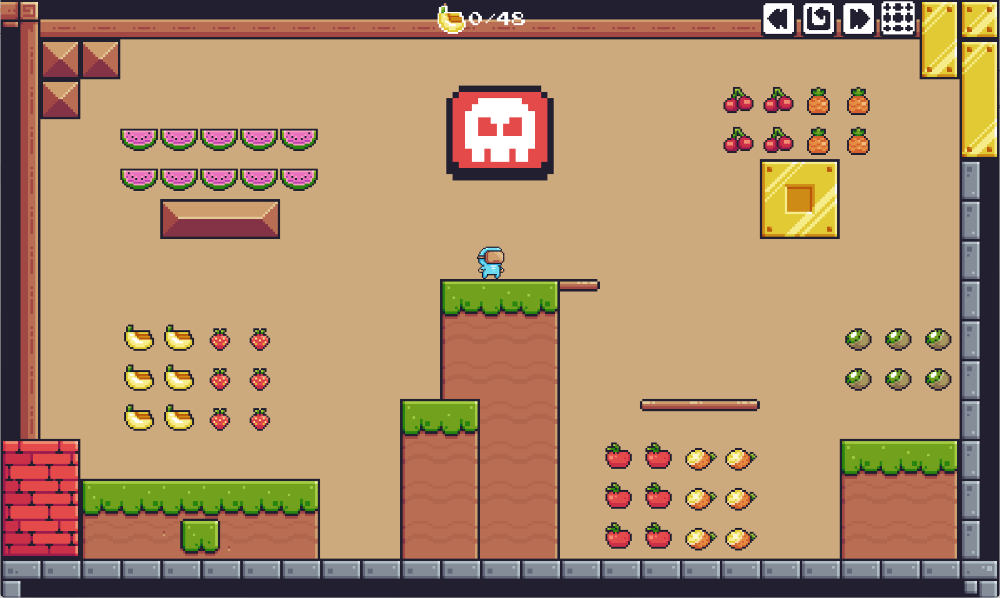

<div align="center" style="text-align: center;">
  <h1>🍋 Lemon 🥝 Kiwi</h1>
</div>

<div align="center" style="text-align: center;">
  <a href="https://pyro-kineticz.itch.io/lemon-kiwi">
    
  </a>
</div>

---

### Bounce, Snack, Survive!

Step into the shoes of our hungry blue chibi. **Lemon Kiwi** is a high-energy 2D platformer where your only goal is to eat every fruit in sight—but the world wants to stop you.

## 🎮 Play Now
**Download the latest version on itch.io:**  
👉 **[Play Lemon Kiwi on itch.io](https://pyro-kineticz.itch.io/lemon-kiwi)**

## 🌟 Features

*   🏃 **Run & Jump**: Tight controls for precision platforming.
*   🍎 **Fruit-Fueled Progression**: Clear levels by snacking on delicious collectibles.
*   🔥 **Deadly Traps**: Navigate a gauntlet of fire pits and razor-sharp spikes.
*   🤸 **Bounce Mechanics**: Use trampolines to reach dizzying heights and secret areas.
*   🎨 **Super Colorful Graphics**: A bright, cheerful art style that pops off the screen.

## 🚀 Getting Started

To get a local copy of the source code up and running:

1. **Clone the repo**
   ```bash
   git clone https://github.com
   
2. **Run main.py**
   ```bash
   Alternatively, you can skip the setup and download the .exe directly from the itch.io page.

## 🕹️ Controls
**Arrows / WASD:** Move and Jump

**Objective:** Eat all the fruit to unlock the next level while avoiding spikes and fire!

Have fun ❤️
